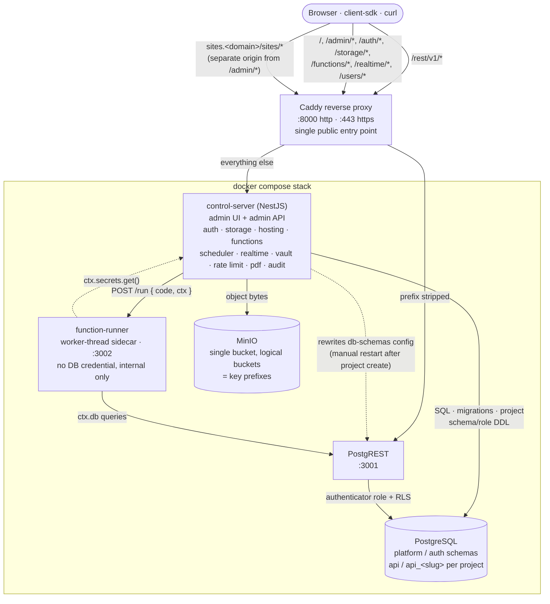

# personal-baas

Self-hosted, lightweight Backend-as-a-Service. Point it at a Postgres schema and get back a
secure REST API, auth, storage, serverless functions, and an admin console — running entirely on
your own infrastructure.

Core stack: **PostgreSQL + PostgREST + a NestJS control service** (admin UI, admin API, auth,
storage, functions, and everything else that isn't a raw data API) behind a single **Caddy**
reverse-proxy entry point.

See [`scope.md`](./scope.md) for the full product/architecture spec,
[`docs/implementation-plan.md`](./docs/implementation-plan.md) for the phased build log,
[`docs/install.md`](./docs/install.md) for a full install/deploy walkthrough,
[`docs/upgrade.md`](./docs/upgrade.md) for the upgrade procedure, and
[`AGENTS.md`](./AGENTS.md) for repository/coding conventions if you're picking up development.

## What's included

| Area | Features |
| --- | --- |
| Data API | Instant REST API over tables/views/functions (PostgREST), row-level security, SQL editor & DB explorer, API Explorer, generated OpenAPI spec for the public integration surface |
| Auth | Email/password signup & login, project-scoped JWTs, TOTP MFA with backup codes, rate limiting & brute-force lockout, service-role project user directory |
| Storage & hosting | Per-user/per-bucket object storage, static site hosting |
| Compute | Serverless JS/TS functions in an isolated worker (no separate deploy pipeline), cron-style scheduler |
| Platform services | Encrypted secrets vault, transactional email, on-demand PDF generation |
| Multi-tenancy & ops | Multi-project isolation (separate schemas/roles per project), audit log of every operator action |

## Architecture



Key points for anyone picking this up:

- **Caddy is the only public port.** `/rest/v1/*` is stripped and proxied straight to PostgREST;
  `/auth/*`, `/storage/*`, `/functions/*`, `/realtime/*`, `/users/*`, `/openapi.json`, `/admin*`
  and `/health*` go to control-server on the main domain. Static site hosting (`/sites/*`)
  deliberately lives on its own `sites.<domain>` host instead (security remediation, scope.md
  §39) — tenant-uploaded site content must never share an origin with `/admin/*`. See
  [`infrastructure/proxy/Caddyfile`](./infrastructure/proxy/Caddyfile) for the exact table.
- **PostgreSQL is the source of truth.** `packages/database-bootstrap/sql/*` creates base
  roles/schemas once at container init; `apps/control-server/migrations/*` (node-pg-migrate)
  owns platform/auth schema changes. Application schemas (`api`, `api_<slug>`) are
  developer-managed through the SQL editor, and PostgREST exposes them via Postgres
  grants/RLS plus JWT role switching — authorization lives in the database, not app code.
- **Multi-project isolation is schema + role, not container.** Each project gets its own
  `api_<slug>` schema and `anon_<slug>`/`authenticated_<slug>`/`service_role_<slug>` roles on the
  same Postgres instance. Creating a project rewrites the shared PostgREST config volume, but
  PostgREST only picks up new schemas/roles after a manual `docker compose restart postgrest`.
- **`function-runner` is a sandboxed sibling process**, not a library inside control-server — a
  crashing or malicious function can't take control-server down with it. It holds no database
  credential, executes each invocation in a fresh worker thread, and only ever receives
  already-authorized code + context from control-server over the internal Docker network (no
  public route, no host port).
- **MinIO backs one real bucket for the whole deployment**; developer-facing "buckets" are
  metadata/key prefixes in `storage.buckets`, not separate MinIO buckets. Clients only ever talk
  to `/storage/v1/*` on control-server — MinIO credentials never leave control-server.

## Repository layout

```
apps/control-server/        NestJS control service: admin API + admin UI + auth + rest config
apps/function-runner/       Isolated Node worker-thread sidecar that executes project functions
packages/client-sdk/        TypeScript client SDK (PostgREST-shaped: auth, query builder, storage)
packages/shared-types/      Types shared across apps/packages
packages/database-bootstrap/ One-time role/schema init SQL (platform/auth/api/private)
infrastructure/docker/      docker-compose.yml, Dockerfiles
infrastructure/postgres/    Postgres init wiring, event-trigger SQL
infrastructure/postgrest/   postgrest.conf template
infrastructure/proxy/       Caddyfile (public routing table)
distribution-kit/           Pre-built-image compose overlay for running outside the monorepo
examples/                   Sample frontend apps using the SDK (todo-app, ats-app)
docs/                       Install, upgrade, and implementation-plan guides
```

## Quick start

```bash
cp .env.example .env
npm install
npm run generate:jwt-keys --workspace apps/control-server    # fills AUTH_JWT_* in .env
npm run generate:vault-key --workspace apps/control-server   # fills VAULT_MASTER_KEY_BASE64
# now fill in the remaining change_me_* passwords/secrets in .env
docker compose --env-file .env -f infrastructure/docker/docker-compose.yml up --build
```

(the `--env-file` flag is required because `docker-compose.yml` lives in `infrastructure/docker/`,
not the repo root, so Compose won't discover `.env` on its own)

This starts PostgreSQL, PostgREST, the NestJS control service, the function-runner sidecar,
MinIO, and the Caddy reverse proxy, exposed on:

```
http://localhost:8000   (plain HTTP, dev convenience)
https://localhost:443   (HTTPS — see TLS below)
```

Migrations run automatically as a one-shot container before control-server starts, and a
"Default Project" already exists — sign in at `http://localhost:8000/admin/login` with the
`INITIAL_ADMIN_EMAIL`/`INITIAL_ADMIN_PASSWORD` you set in `.env`. See
[`docs/install.md`](./docs/install.md) for the full first-run walkthrough (first login, creating
a project, your first table, API keys, and connecting a client app).

### Running it without the monorepo

[`distribution-kit/`](./distribution-kit) packages the whole platform as pre-built images behind
one self-contained `docker-compose.personal-baas.yml`, for dropping into another project without
cloning this repo. See [`distribution-kit/README.md`](./distribution-kit/README.md).

## TLS

Caddy serves HTTPS on `:443` alongside the plain-HTTP `:8000` dev endpoint above. Three ways to run it:

- **Default (no config)** — `PUBLIC_DOMAIN` defaults to `localhost`. Caddy recognizes this isn't
  a publicly-resolvable domain and automatically serves a certificate from its own internal CA.
  Your browser will show a one-time trust warning the first time (self-signed, but a real
  certificate — it works the same as any HTTPS site otherwise, and is stable across restarts
  because Caddy's cert/CA state lives in the `caddy_data` volume).
- **Real domain, automatic Let's Encrypt** — set `PUBLIC_DOMAIN` in `.env` to a real domain that
  resolves to this host, with ports 80 and 443 reachable from the internet, and Caddy
  automatically obtains and renews a trusted Let's Encrypt certificate. No other changes needed.
- **Bring your own certificate** — mount your cert/key files into the `caddy` container (add a
  volume in `docker-compose.yml`) and replace the HTTPS site block's address line in
  `infrastructure/proxy/Caddyfile` with `tls /path/to/cert.pem /path/to/key.pem`.

## Development

This is an npm-workspaces monorepo (Node.js >= 22). Core versions: NestJS 11, PostgreSQL 16,
PostgREST v12.2.3, Caddy 2, MinIO.

```bash
npm install
npm run dev:control-server   # start:dev for apps/control-server only
npm run build                # build all workspaces
npm run lint
npm run format:check
npm run test
```

Targeted workspace commands you'll likely want while iterating:

```bash
npm run build --workspace apps/control-server
npm run start:dev --workspace apps/control-server
npm run build --workspace apps/function-runner
npm run test --workspace packages/client-sdk
npm run test --workspace packages/client-sdk -- query-builder.spec.ts
npm run build --workspace packages/client-sdk
npm run dev --workspace examples/ats-app
```

Stack/migration commands (see Quick start above for the full first-run sequence):

```bash
npm run migrate:up
npm run migrate:down
npm run migrate:create
npm run compose:up      # docker compose --env-file .env -f infrastructure/docker/docker-compose.yml up --build
npm run compose:down
```

For coding conventions (Nest feature-module shape, validation patterns, security-sensitive
comment rules, etc.), directory-by-directory ownership, and a fuller command reference, see
[`AGENTS.md`](./AGENTS.md) — it's kept current for anyone (human or agent) picking up work here.

## Testing

Active automated tests are Jest 29 + `ts-jest` under `packages/client-sdk/test/*.spec.ts`.

```bash
npm run test
npm run test --workspace packages/client-sdk
npm run test --workspace packages/client-sdk -- http.spec.ts
```

There's no CI workflow or coverage threshold in this repo yet — for behavioral changes, run the
narrowest relevant workspace test/build and, for stack changes, smoke-test the Docker path plus
the `/health` and `/health/ready` endpoints.
